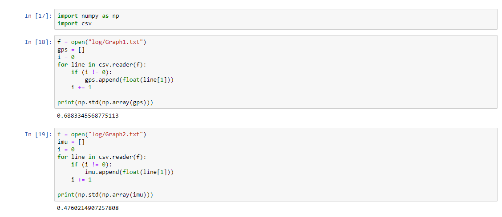
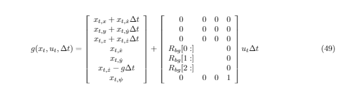
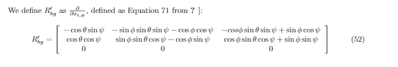
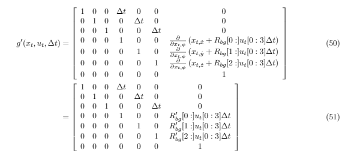
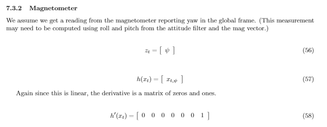
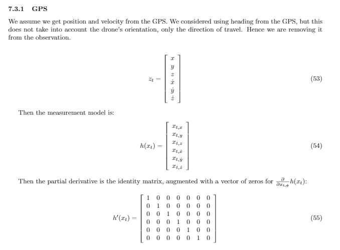
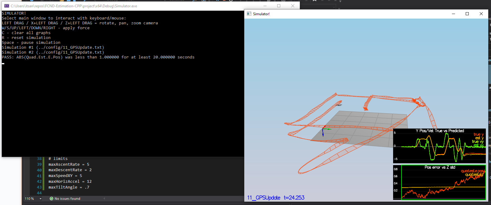

# Step 1: Sensor Noise
## Determine the standard deviation of the measurement noise of both GPS X data and Accelerometer X data.

#### The calculated standard deviation should correctly capture ~68% of the sensor measurements. Your writeup should describe the method used for determining the standard deviation given the simulated sensor measurements.

The simulated measurements were logged into a csv in the config/log/ folder. 

In the config folder, a jupyter notebook called ```Find-Standard-Deviations.ipynb``` was created to read all the numbers in the log files (Graph1.txt and Graph2.txt) into a list of floating point numbers using the ```import csv``` library. ```numpy``` was then used to calculate the standard deviation from the list of numbers.

The code can bee seen bellow: 


It outputs the std dev for both GPS and IMU, and those values are then copied to ```06_SensorNoise.txt``` as seen below:

```
### STUDENT SECTION

MeasuredStdDev_GPSPosXY = 0.6761277422686578
MeasuredStdDev_AccelXY = 0.48268567998594486

### END STUDENT SECTION
```

# Step 2: Attitude Estimation
# Implement a better rate gyro attitude integration scheme in the UpdateFromIMU() function.

#### The improved integration scheme should result in an attitude estimator of < 0.1 rad for each of the Euler angles for a duration of at least 3 seconds during the simulation. The integration scheme should use quaternions to improve performance over the current simple integration scheme.

Initialize a quaternion from the estimated attitude (consisting of rollEst, pitchEst, and ekfState(6)). Then call the IntergrateBodyRate function provided by the Quaternion class, passing in the turn rates in the body from (gyro measurements), and the delta t (dtIMU).

After intergrating, just initalize the new predicted attitude angles by calling the Quaternion's Pitch, Roll, Yaw functions. 

These predicted angles will then be used for the complementary filter implemented in the rest of the function UpdateFromIMU().

```
Quaternion<float> attitude = EstimatedAttitude();
attitude.IntegrateBodyRate(gyro, dtIMU);

float predictedPitch = attitude.Pitch();
float predictedRoll = attitude.Roll();
ekfState(6) = attitude.Yaw();	// yaw
```

# Step 3: Prediction Step
## Implement all of the elements of the prediction step for the estimator.

#### The prediction step should include the state update element (PredictState() function), a correct calculation of the Rgb prime matrix, and a proper update of the state covariance. The acceleration should be accounted for as a command in the calculation of gPrime. The covariance update should follow the classic EKF update equation.

### Implement ```PredictState(VectorXf curState, float dt, V3F accel, V3F gyro)``` Function 

Essentially, write code to implement the g function as described in the paper: 

Which is essentially linear approximation for all components of the state, but u_t is in the body frame, so it needs to be converted into the global frame by multiplying Rbg and u_t together to get the u_t (acceleration) in the global frame.

In the code, this is done by: 
```
V3F global_accel = attitude.Rotate_BtoI(accel); \\ converting accel from body frame to global frame using Rotate_BtoI()
```

Then linear approximation is done to all variables, keeping in mind to subtract g*dt for predicting z_dot:
```
predictedState[0] = curState[0] + curState[3] * dt;
predictedState[1] = curState[1] + curState[4] * dt;
predictedState[2] = curState[2] + curState[5] * dt;
predictedState[3] = curState[3] + global_accel.x * dt;
predictedState[4] = curState[4] + global_accel.y * dt;
predictedState[5] = curState[5] - CONST_GRAVITY * dt + global_accel.z * dt;
```

### Implement ```GetRbgPrime(float roll, float pitch, float yaw)``` Function 
Just implement code to set all values of the 3x3 matrix to the following equation in the paper: 


```
RbgPrime(0, 0) = -cos(pitch) * sin(yaw);
RbgPrime(0, 1) = -sin(roll) * sin(pitch) * sin(yaw) - cos(roll) * cos(yaw);
RbgPrime(0, 2) = -cos(roll) * sin(pitch) * sin(yaw) + sin(roll) * cos(yaw);
RbgPrime(1, 0) = cos(pitch) * sin(yaw);
RbgPrime(1, 1) = sin(roll) * sin(pitch) * sin(yaw) - cos(roll) * cos(yaw);
RbgPrime(1, 2) = cos(roll) * sin(pitch) * sin(yaw) + sin(roll) * cos(yaw);
```
### Implement ```Predict(float dt, V3F accel, V3F gyro)``` Function 

#### The Predict method already calls predict state, so you only need to calculate the new covariance.

First create the Jacobian, g_prime, according to the equation in the paper:


```
// we've created an empty Jacobian for you, currently simply set to identity
  MatrixXf gPrime(QUAD_EKF_NUM_STATES, QUAD_EKF_NUM_STATES);
  gPrime.setIdentity();

  ////////////////////////////// BEGIN STUDENT CODE ///////////////////////////
  
  // create Jacobian 

  gPrime(0, 3) = dt;
  gPrime(1, 4) = dt;
  gPrime(2, 5) = dt;

  Mat3x3F RbgP = Mat3x3F();
  for (int i = 0; i < 3; i++)
  {
      for (int j = 0; j < 3; j++)
      {
          RbgP(i, j) = RbgPrime(i, j);
      }
  }

  V3F partial = RbgP * accel * dt;

  for (int i = 0; i < 3; i++)
  {
      gPrime(6, 3 + i) = partial[i];
  }
```

Then, using the equation for predicting the covariance, write the code for it.


```
MatrixXf newCov = gPrime * ekfCov * gPrime.transpose() + Q;
ekfCov = newCov;
```

# Step 4: Magnetometer Update
## Implement the magnetometer update.
#### The update should properly include the magnetometer data into the state. Note that the solution should make sure to correctly measure the angle error between the current state and the magnetometer value (error should be the short way around, not the long way).

Using the equation for magnetometer in the paper:

Calculate h'(x) and the measurement from the state h(x):

```
VectorXf z(1), zFromX(1);
z(0) = magYaw;

MatrixXf hPrime(1, QUAD_EKF_NUM_STATES);
hPrime.setZero();

////////////////////////////// BEGIN STUDENT CODE ///////////////////////////

// set h'(x)
hPrime(0, 6) = 1;

// set h(x)
zFromX(0) = ekfState(6);
```

#### Note that the solution should make sure to correctly measure the angle error between the current state and the magnetometer value (error should be the short way around, not the long way).

Implement code to account for measure error.

```
float err = z(0) - zFromX(0);
if (err > F_PI) zFromX(0) += 2.f * F_PI;
if (err < -F_PI) zFromX(0) -= 2.f * F_PI;
```

Then the update function is called with z, R_Mag, and the calculated zFromX and hPrime: ```Update(z, hPrime, R_Mag, zFromX);```

# Step 5: Closed Loop + GPS Update
## Implement the GPS update.
#### The estimator should correctly incorporate the GPS information to update the current state estimate.

Using the equation for GPS in the paper:

Calculate h'(x) and the measurement from the state h(x):

```
MatrixXf hPrime(6, QUAD_EKF_NUM_STATES);
hPrime.setZero();

////////////////////////////// BEGIN STUDENT CODE ///////////////////////////

for (int i = 0; i < 6; i++)
{
    hPrime(i, i) = 1;
    zFromX(i) = ekfState(i);
}
```

Then the update function is called with z, R_GPS, and the calculated zFromX and hPrime: ```Update(z, hPrime, R_GPS, zFromX);```

# Step 6: Adding Your Controller
## De-tune your controller to successfully fly the final desired box trajectory with your estimator and realistic sensors.
#### The controller developed in the previous project should be de-tuned to successfully meet the performance criteria of the final scenario (<1m error for entire box flight).

QuadControl.cpp and QuadControlParams.txt were copied over and then retuned to work with sensor estimation. 

Params were tuned to: 

```
# Position control gains
kpPosXY = 3
kpPosZ = 4
KiPosZ = 30

# Velocity control gains
kpVelXY = 9
kpVelZ = 12

# Angle control gains
kpBank = 14
kpYaw = 4

# Angle rate gain
kpPQR = 55, 55, 10
```

Below is the output of scenario 11 with the tuned params and controllers implemented:

